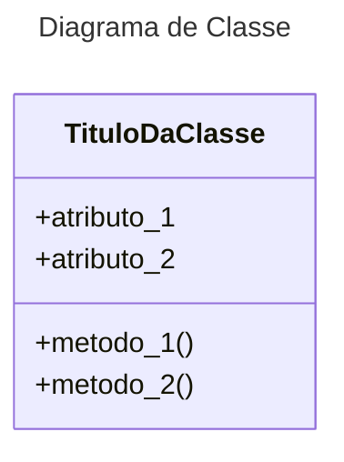
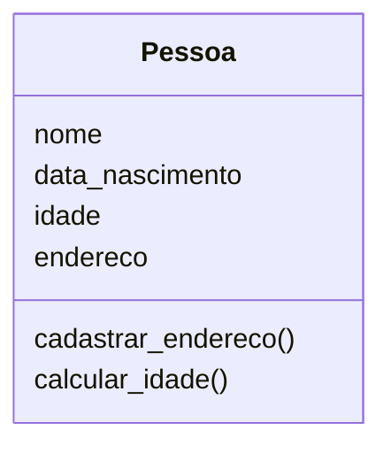

# POO
## Programação Orientada à Objetos

Diagrama de classe



* atributo_1 e atributo_2 são propriedades/características de cada classe, são o equivalentes à variáveis.
* metodo_1 e metodo_2 são metodos/ações de cada classe, são o equivalentes à funções, são as ações que ocorrem no código.

## Exemplo de implementação



### Classe Pessoa
Esta classe representa o cadastro de uma pessoa, um cadastro genérico que pode servir de base para vários tipos de cadastro (escola, loja, academia, _etc._)  
Uma pessoa é representada pelo seu nome, idade, data_nascimento e endereco, e é pensado em dois métodos, um para cadastrar o endereco e outro para calcular a idade de uma pessoa baseado em sua data de nascimento.  
Vamos ver a implementação desta classe em Python.

```python
from datetime import datetime

class Pessoa():

    def __init__(self, name, dayBirth, monthBirth, yearBirth):
        self.nome = name
        self.data_nascimento = datetime(yearBirth, monthBirth, dayBirth)
        self.idade = self.calcular_idade()
        self.endereco = ''
    
    def calcular_idade(self):
        today = datetime.now()
        return int((today-self.data_nascimento).days//365.2425)

    def cadastrar_endereco(self,rua,numero):
        self.endereco = f'{rua}, {numero}'
```