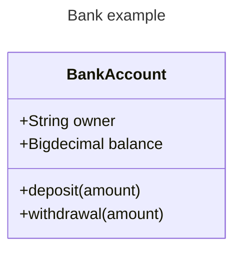

# POO
## Programação Orientada à Objetos

Diagrama de classe

```mermaid
---
title: Diagrama de Classe
---
ClassDiagram
    class TituloDaClasse{
        +Literal atributo_1
        +Numerico atributo_2
        +metodo_1()
        +metodo_2()
    }

```

