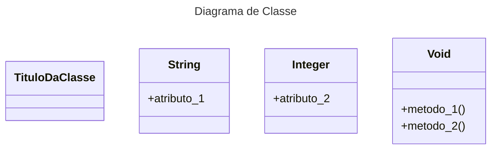

# POO
## Programação Orientada à Objetos

Diagrama de classe

```mermaid
---
title: Diagrama de Classe
---
classDiagram
    class TituloDaClasse
        String: +atributo_1
        Integer: +atributo_2
        Void: +metodo_1()
        Void: +metodo_2()
```
