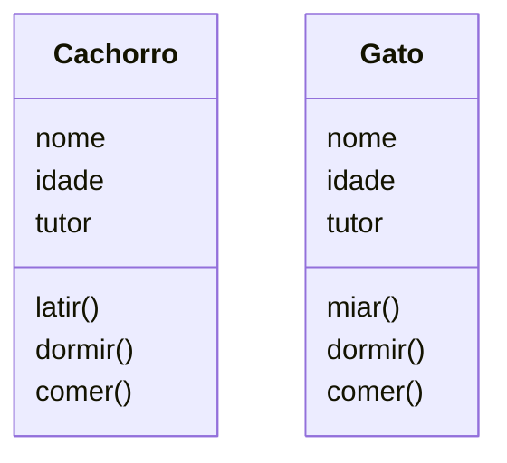
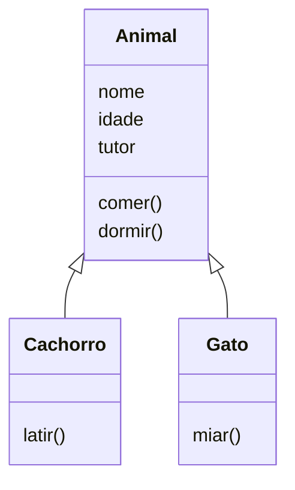

# Herança

A grande jogada do POO é a possibilidade de reaproveitar código. Ou seja, não precisar criar o mesmo código, mas sim, importar e utilizar.

Em OO a forma mais comum de fazermos isto é utilizar o recurso de herança.
Para compreender imagine duas classe Cachorro e Gato:



Vamos comparar as duas classes e ver o que elas tem em comum, o primeiro item que devemos levar em consideração é que Gato e Cachorro são Animais, então podemos criar uma class Animal que fornecerá características que todos os animais tem.




Exemplificando em Python:

```python
#arquivo animal.py
class Animal:
    def __init__(self,nome, idade, tutor):
        self.nome = nome
        self.idade = idade
        self.tutor = tutor

    def comer(self):
        pass

    def dormir(self):
        pass
```
```python
#arquivo cachorro.py

from animal import Animal # do modulo animal importa a classe Animal

class Cachorro(Animal):
    def __init__(self,nome, idade, tutor):
        super(nome,idade,tutor)

    def latir(self):
        pass
```

```python
#arquivo gato.py

from animal import Animal # do modulo animal importa a classe Animal

class Gato(Animal):
    def __init__(self,nome, idade, tutor):
        super(nome,idade,tutor)

    def miar(self):
        pass
```